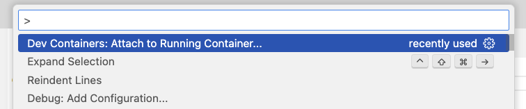
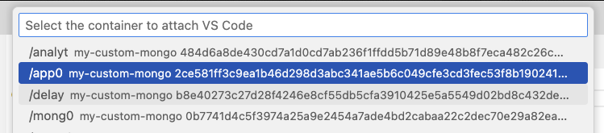

# mongo-repl-test

## To be done once

1. Install **Docker Desktop** and (for MongoDB employees) request a **Docker** license from the Lumos app store (available via [corp.mongodb.com](https://corp.mongodb.com/))
1. Install the **Dev Containers** **VS Code** extension
1. Create the Docker network:

```bash
docker network create mongo-net
```

## To be done first time or whenever there's a new version of the docker image

1. Delete any existing containers and images for this demo
1. Fetch the latest Docker image:

```bash
docker pull andrewmorgan818/mongodb-replication-demo:latest
```

3. Create the containers and connect them to our Docker network

```bash
docker run -dit \
  --name mongo0 \
  --hostname mongo0 \
  --network mongo-net \
  -p 27017:27017 \
  andrewmorgan818/mongodb-replication-demo bash
```
```bash
docker run -dit \
  --name mongo1 \
  --hostname mongo1 \
  --network mongo-net \
  -p 27018:27017 \
  andrewmorgan818/mongodb-replication-demo bash
```
```bash
docker run -dit \
  --name mongo2 \
  --hostname mongo2 \
  --network mongo-net \
  -p 27019:27017 \
  andrewmorgan818/mongodb-replication-demo bash
```
```bash
docker run -dit \
  --name analytics \
  --hostname analytics \
  --network mongo-net \
  -p 27020:27017 \
  andrewmorgan818/mongodb-replication-demo bash
```
```bash
docker run -dit \
  --name app0 \
  --hostname app0 \
  --network mongo-net andrewmorgan818/mongodb-replication-demo bash
```

4. Edit the `/etc/mongod.conf` MongoDB configuration file on each MongoDB node (`mongo0`, `mongo1`, `mongo2`, `analytics`) using the files from this repo (under `mongodb-cfg-files`). Do this by connecting to each node from the terminal:

```bash
docker exec -it mongo0 bash
```
```bash
docker exec -it mongo1 bash   
```
```bash
docker exec -it mongo2 bash   
```
```bash
docker exec -it analytics bash    
```
```bash
docker exec -it app0 bash   
```

- The only thing that should need to change in each config file is that `bindIp: 127.0.0.1,mongoX` should use the node/hostname (one of `mongo0`, `mongo1`, `mongo2`, `analytics`) rather than `mongoX`.

5. Start `mongod` on each node (all containers apart from `app0`):

```bash
mongod --config /etc/mongod.conf&
```

6. On `mongo0`, initiate the replica set:

```bash
mongosh
```

```js
rs.initiate(
  {
     _id: "mongodb-repl-set",
     version: 1,
     members: [
        { _id: 0, host : "mongo0" },
        { _id: 1, host : "mongo1" },
        { _id: 2, host : "mongo2" }
     ]
  }
)
```

## On-site, before the demo

1. Start the containers from Docker Desktop
1. Connect a seperate terminal tab to each of the nodes:

```bash
docker exec -it mongo0 bash
```
```bash
docker exec -it mongo1 bash   
```
```bash
docker exec -it mongo2 bash   
```
```bash
docker exec -it analytics bash    
```
```bash
docker exec -it app0 bash   
```

3. Start the `mongod` process on `mongo0`, `mongo1`, `mongo2`, `analytics`, and `delayed`:

```bash
mongod --config /etc/mongod.conf&
```

4. Connect VS Code to `app0`: 
  - Execute (`command-ctrl-p`) `Dev Containers: Attach to Running Container`:
  
  
  
  - Connect to `app0`:
  
  

## Running the HA demo
### Setting the scene

1. From any node, connect the mongo shell (`mongosh`) and confirm that the replica set is up and running:

```bash
mongosh "mongodb://mongo0:27017,mongo1:27017,mongo2:27017/?authSource=admin&replicaSet=mongodb-repl-set"
```

```js
function rsSummary() {
  const config = rs.config();
  return rs.status().members.map((m, i) => ({
    name: m.name,
    stateStr: m.stateStr,
    health: m.health,
    priority: config.members[i].priority
  }));
}

rsSummary()
```

2. Show the demo app code in `/home/src/mongo-repl-test/app.js`
3. Run the demo app:
- From the VS Code terminal:

```bash
cd /home/src/mongo-repl-test
git pull # optional
npm install # optional
npm start
```

4. Observe the output from the app:

```bash
npm start
```
```bash
> replica-set-tester@1.0.0 start
> node app.js

[2025-08-12T09:16:59.576Z] Current value: 1
[2025-08-12T09:17:00.068Z] Incremented
[2025-08-12T09:17:00.079Z] Current value: 2
[2025-08-12T09:17:00.576Z] Current value: 2
[2025-08-12T09:17:01.079Z] Current value: 2
[2025-08-12T09:17:01.074Z] Incremented
[2025-08-12T09:17:01.581Z] Current value: 3
[2025-08-12T09:17:02.083Z] Current value: 4
[2025-08-12T09:17:02.077Z] Incremented
...
```

### Failover when NICELY killing primary process

1. Make the app output visible, and observe the incrementing count
2. From the terminal for the node that's currently primary:

```bash
root@mongo1:/# ps -ef | grep mongod
root        18     1  1 09:22 ?        00:01:57 mongod --config /etc/mongod.conf
root       317   152  0 11:22 pts/2    00:00:00 grep mongod
```
```bash
root@mongo1:/# kill 18
```

3. Observe that the output from the app wasn't interrupted
4. From any node, run rsSummary():

```js
rsSummary()
```
```js
[
  { 
    name: 'mongo0:27017', 
    stateStr: 'PRIMARY', 
    health: 1, 
    priority: 1 
  },
  {
    name: 'mongo1:27017',
    stateStr: '(not reachable/healthy)',
    health: 0,
    priority: 1
  },
  {
    name: 'mongo2:27017',
    stateStr: 'SECONDARY',
    health: 1,
    priority: 1
  }
]
```

5. Note that a new node has taken over as primary
6. Start `mongod` on that node again: 

```bash
mongod --config /etc/mongod.conf&
```

7. Observe that the app output wasn't interrupted
8. Observe that the node has rejoined the cluster:

```js
rsSummary()
```
```js
[
  { 
    name: 'mongo0:27017', 
    stateStr: 'PRIMARY',
    health: 1,
    priority: 1 
  },
  {
    name: 'mongo1:27017',
    stateStr: 'SECONDARY',
    health: 1,
    priority: 1
  },
  {
    name: 'mongo2:27017',
    stateStr: 'SECONDARY',
    health: 1,
    priority: 1
  }
]
```

### Failover when HARD killing primary process

1. Make the app output visible, and observe the incrementing count
2. From the terminal for the node that's currently primary:

```bash
ps -ef | grep mongod
```
```bash
root        19    17  1 09:22 pts/1    00:02:14 mongod --config /etc/mongod.conf
root       348    17  0 11:35 pts/1    00:00:00 grep mongod
```
```bash
kill -9 19
```

3. Observe that the output from the app halts for a few seconds and then continues from where it left off, there are no errors reported by the application
4. From any node, run rsSummary():

```js
rsSummary()
```
```js
[
  {
    name: 'mongo0:27017',
    stateStr: '(not reachable/healthy)',
    health: 0,
    priority: 1
  },
  {
    name: 'mongo1:27017',
    stateStr: 'SECONDARY',
    health: 1,
    priority: 1
  },
  { 
    name: 'mongo2:27017',
    stateStr: 'PRIMARY',
    health: 1,
    priority: 1 
  }
]
```

5. Note that a new node has taken over as primary
6. Start `mongod` on that node again: 

```bash
mongod --config /etc/mongod.conf&
```

7. Observe that the app output wasn't interrupted
8. Observe that the node has rejoined the cluster:

```js
rsSummary()
```
```js
[
  {
    name: 'mongo0:27017',
    stateStr: 'SECONDARY',
    health: 1,
    priority: 1
  },
  {
    name: 'mongo1:27017',
    stateStr: 'SECONDARY',
    health: 1,
    priority: 1
  },
  { 
    name: 'mongo2:27017', 
    stateStr: 'PRIMARY', 
    health: 1, 
    priority: 1 
  }
]
```

### Show original primary with higher priority is elected back to be primary after failing and restarting

1. Set `mongo1` to have a higher priority than the other nodes (from `mongosh`), and also reduce the timeout for failover:

```js
config = rs.conf()
config.members[1].priority = 10 // mongo1
config.settings.electionTimeoutMillis = 1000;  // Lower to 1 second
rs.reconfig(config)
```

2. Observe that `mongo1` has been elected to primary and now has a higher priority than the other nodes:

```js
rsSummary()
```
```js
[
  {
    name: 'mongo0:27017',
    stateStr: 'SECONDARY',
    health: 1,
    priority: 1
  },
  {
    name: 'mongo1:27017',
    stateStr: 'PRIMARY',
    health: 1,
    priority: 10
  },
  {
    name: 'mongo2:27017',
    stateStr: 'SECONDARY',
    health: 1,
    priority: 1
  }
]
```

3. `kill -9` `mongod` on `mongo1` and notice that the app doesn't pause for as long as before
4. Restart `mongod` on `mongo1`
5. From `mongosh`, confirm that `mongo1` has rejoined the replica set and been reelected to primary

```js
rsSummary()
```
```js
[
  {
    name: 'mongo0:27017',
    stateStr: 'SECONDARY',
    health: 1,
    priority: 1
  },
  {
    name: 'mongo1:27017',
    stateStr: 'PRIMARY',
    health: 1,
    priority: 10
  },
  {
    name: 'mongo2:27017',
    stateStr: 'SECONDARY',
    health: 1,
    priority: 1
  }
]
```

6. Set the timeout to 5 seconds:

```js
config = rs.conf()
config.settings.electionTimeoutMillis = 5000;  // Increase to 5 seconds
rs.reconfig(config)
```

### Change the connection string so that reads aren't delayed when primary fails

1. Stop the application (`ctrl-c`)
2. Edit `app.js` to include the `primaryPreferred` read preference:

```js
const readCol = db.collection("counter", { readPreference: ReadPreference.primaryPreferred });
```

3. Restart the application (`npm start`)
4. `kill -9` the primary `mongod`
5. Observe that the reads continue, but the counter is not incremented for a few seconds:

```js
[2025-08-12T11:57:34.583Z] Current value: 2408
[2025-08-12T11:57:34.867Z] Incremented
[2025-08-12T11:57:35.083Z] Current value: 2409
[2025-08-12T11:57:35.587Z] Current value: 2409
[2025-08-12T11:57:36.095Z] Current value: 2409
[2025-08-12T11:57:36.601Z] Current value: 2409
[2025-08-12T11:57:37.104Z] Current value: 2409
[2025-08-12T11:57:37.604Z] Current value: 2409
[2025-08-12T11:57:38.107Z] Current value: 2409
[2025-08-12T11:57:38.610Z] Current value: 2409
[2025-08-12T11:57:39.115Z] Current value: 2409
[2025-08-12T11:57:39.615Z] Current value: 2409
[2025-08-12T11:57:40.116Z] Current value: 2409
[2025-08-12T11:57:40.619Z] Current value: 2409
[2025-08-12T11:57:35.869Z] Incremented
[2025-08-12T11:57:37.877Z] Incremented
[2025-08-12T11:57:36.872Z] Incremented
[2025-08-12T11:57:38.881Z] Incremented
[2025-08-12T11:57:39.882Z] Incremented
[2025-08-12T11:57:40.886Z] Incremented
[2025-08-12T11:57:41.120Z] Current value: 2415
```

6. Restart `mongod` on `mongo1`

## Isolate the primary node from the network

1. `mongo1` should still be the primary as it has the highest priority; isolate it from the Docker network:

```bash
docker network disconnect mongo-net mongo1
```

2. Confirm that `mongo1` is not a functioning member of the replica set:

```js
rsSummary()
```
```js
[
  { 
    name: 'mongo0:27017', 
    stateStr: 'PRIMARY', 
    health: 1, 
    priority: 1 
  },
  {
    name: 'mongo1:27017',
    stateStr: '(not reachable/healthy)',
    health: 0,
    priority: 10
  },
  {
    name: 'mongo2:27017',
    stateStr: 'SECONDARY',
    health: 1,
    priority: 1
  }
]
```

3. Try connecting `mongosh` to the replica set with only `mongo1` in the connection string:

```bash
mongosh "mongodb://mongo1:27017/?authSource=admin&replicaSet=mongodb-repl-set"
```

```js
mongosh "mongodb://mongo1:27017/?authSource=admin&replicaSet=mongodb-repl-set"
```
```js
Current Mongosh Log ID:	689b30d9f67c0664e8d2950c
Connecting to:		mongodb://mongo1:27017/?authSource=admin&replicaSet=mongodb-repl-set&appName=mongosh+2.5.1
MongoServerSelectionError: getaddrinfo EAI_AGAIN mongo1
```

4. Check if the process has been stopped on mongo1:

```js
ps -ef | grep mongod 
```
```js
root      1726  1636  0 11:21 pts/2    00:00:00 grep mongod
```

5. If the `mongod` process is still running, connect to `mongo1` using `mongosh` and confirm that it rejects writes:

```bash
root@mongo1:/# mongosh
```
```js
db.fluff.insertOne({})
```
```js
MongoServerError[NotWritablePrimary]: not primary
````

6. Add `mongo1` back to the network:

```bash
docker network connect mongo-net mongo1
```

7. Confirm that `mongo1` is reelected to be primary

### Kill (rather than gracefully stoping) the docker container

1. Kill the `mongo1` container:

```bash
docker kill mongo1
```

2. Note from the app output that writes are paused during the failover/election
3. Restart the container
4. Restart `mongod`
5. Observe from `mongosh` that `mongo1` rejoins the replica set and is reelected primary

### Add an analytics node (if not using Atlas)

1. If not already running, start `mongod` on `analytics`
2. Add the node to the replica set (from `mongosh`):

```js
rs.add({
  host: "analytics:27017",
  priority: 0,
  tags: { role: "analytics" }
});
```

3. Uncomment the analytics thread in `app.js` and restart the app:

```js
const analyticsCol = db.collection("counter", { 
  readPreference: { mode: "secondary", tags: [{ role: "analytics" }] } });

// Analytics thread
setInterval(async () => {
  try {
    const doc = await analyticsCol.findOne({ _id: "counter" });
    const now = new Date().toISOString();
    console.log(`ANALYTICS: [${now}] Current value: ${doc?.value}`);
  } catch (err) {
    console.error("Read error:", err.message);
  }
}, 5000);
```

## Remove a node

1. Remove the analytics node and show that the application continues running:

```js
rs.remove("analytics:27017");
```

## (Optional) Save and publish the image based on one of these containers

```bash
docker commit app0 andrewmorgan818/mongodb-replication-demo
docker push andrewmorgan818/mongodb-replication-demo:latest
```
